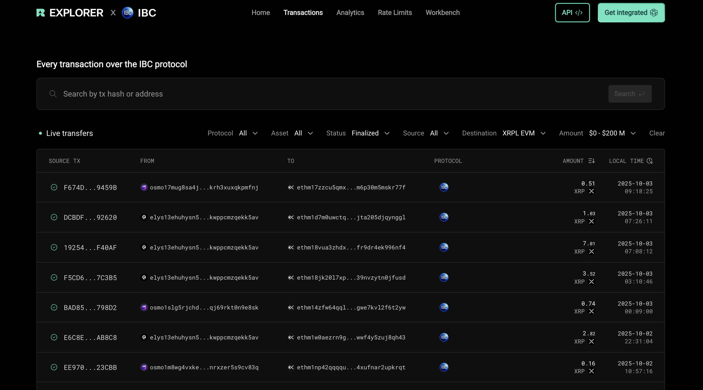

# Inter-Blockchain Communication Protocol (IBC)

## What is IBC? Enabling Seamless Cross-Chain Communication

Blockchain ecosystems often struggle with interoperability — the ability to securely and efficiently communicate across different chains. The **Inter-Blockchain Communication Protocol (IBC)** solves this challenge by providing a standardized, permissionless way for blockchains to exchange data, messages, and tokens.

As a Cosmos-based blockchain, the **XRPL EVM Sidechain** implements IBC natively, enabling seamless integration with other Cosmos SDK chains and any blockchain that supports IBC. This unlocks cross-chain token transfers, interoperability of decentralized applications, and the ability to build an “internet of blockchains” where independent ecosystems connect without intermediaries.

IBC relies on secure light client verification, relayers, and consensus guarantees from the connected chains, ensuring trust-minimized communication. It consists of two layers:

* **Transport Layer (TAO):** Establishes secure connections and authenticates data packets.
* **Application Layer:** Defines how data packets (e.g., token transfers via ICS20) are structured and interpreted by sender and receiver chains.

By leveraging IBC, XRPL EVM can bridge assets, liquidity, and smart contract functionality across multiple blockchain networks, bringing native DeFi utility to XRP and extending Cosmos ecosystem connectivity.

---

## Using IBC

IBC is fully integrated into the XRPL EVM, enabling XRPL’s bridged XRP and other assets to move seamlessly across Cosmos networks. Developers and users can:

* Transfer tokens between XRPL EVM and Cosmos chains using **ICS20 IBC transfers**.
* Relay arbitrary messages and data across chains.
* Build DeFi and dApp integrations that leverage multi-chain liquidity.

For a practical, step-by-step walkthrough of sending assets with Keplr, see the guide: [Sending XRP Through IBC](../users/sending-through-ibc.md).

👉 For more technical information on IBC, see the official [IBC documentation](https://ibc.cosmos.network/).

---

### Exploring IBC Transfers

To inspect live and historical IBC transfer activity, you can use [Range IBC explorer](https://ibc.range.org/transactions)

Recommended usage:
* Use the direction (Source/Destination) filters to distinguish outbound vs inbound transfers.
* Click into a transaction to view packet details (channel IDs, sequence, timeout, status) and cross-reference with on-chain hashes.

This is a helpful tool for debugging stuck transfers, validating channel IDs listed below, and gaining insight into overall IBC flow.

---

## Available IBC Channels

The XRPL EVM Sidechain currently maintains **active IBC connections** with several Cosmos Hub networks and leading Cosmos chains. Below are the available mainnet and testnet channels:

### Mainnet Channels

| Destination  | From XRPL EVM (Source → Dest) | To XRPL EVM (Dest → Source) |
| ------------ | ----------------------------- | --------------------------- |
| Cosmos Hub   | `channel-2`                   | `channel-1377`              |
| Elys Network | `channel-1`                   | `channel-27`                |
| Injective    | `channel-0`                   | `channel-436`               |
| Osmosis      | `channel-3`                   | `channel-104325`            |
| Noble        | `channel-4`                   | `channel-152`               |

📖 Mainnet IBC JSON configs: [Cosmos Chain Registry](https://github.com/cosmos/chain-registry/tree/master/_IBC)

---

### Testnet Channels

| Destination                | From XRPL EVM (Source → Dest) | To XRPL EVM (Dest → Source) |
| -------------------------- | ----------------------------- | --------------------------- |
| CosmosHub Provider Testnet | `channel-1`                   | `channel-374`               |
| Osmosis Testnet            | `channel-2`                   | `channel-10361`             |
| Elys Network Testnet       | `channel-3`                   | `channel-10`                |
| Injective Testnet          | `channel-4`                   | `channel-77038`             |

📖 Testnet IBC JSON configs: [Cosmos Chain Registry (testnets)](https://github.com/cosmos/chain-registry/tree/master/testnets/_IBC)
