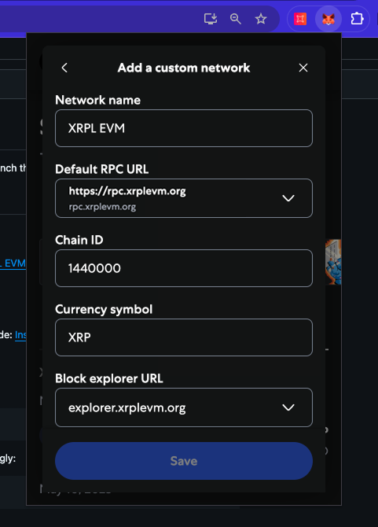
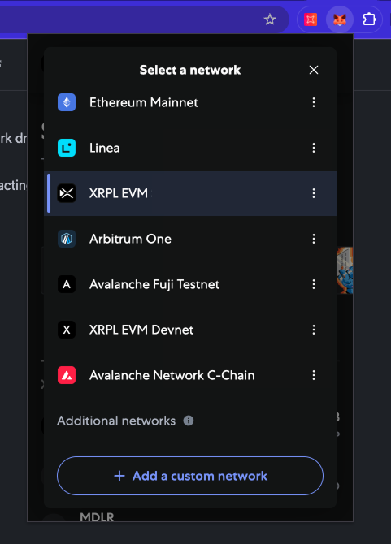
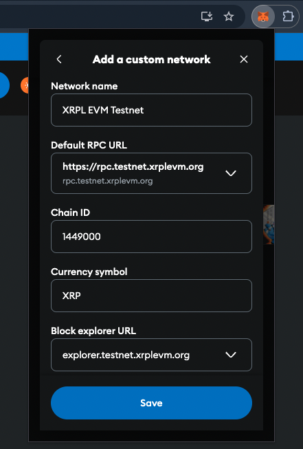

# Connect MetaMask to the XRPL EVM Sidechain

This guide will walk you through configuring MetaMask to connect to the XRPL EVM Sidechain.

## Adding XRPL EVM Sidechain to MetaMask

To interact with the XRPL EVM Sidechain, you need to manually add it as a custom network in MetaMask.

1. **Open MetaMask:**

   - Click the MetaMask icon in your browser to open the wallet.

2. **Access Network Settings:**

   - In the MetaMask interface, click the network dropdown at the top (default is "Ethereum Mainnet").
   - Select **"Add Network."**

   




3. **Enter Network Details:**

   - Fill in the following information:
     - **Network Name:** XRPL EVM
     - **New RPC URL:** [https://rpc.xrplevm.org/](https://rpc.xrplevm.org/)
     - **Chain ID:** 1440000
     - **Currency Symbol:** XRP
     - **Block Explorer URL:** [https://explorer.xrplevm.org](https://explorer.xrplevm.org)

   

4. **Save Network:**

   - Click **"Save."** The XRPL EVM will now be available in the network dropdown.

5. **Switch Networks:**

   - Select **"XRPL EVM"** from the network dropdown to start interacting with the network.

   



3. **Enter Network Details:**

   - Fill in the following information:
     - **Network Name:** XRPL EVM Testnet
     - **New RPC URL:** [https://rpc.testnet.xrplevm.org/](https://rpc.testnet.xrplevm.org/)
     - **Chain ID:** 1449000
     - **Currency Symbol:** XRP
     - **Block Explorer URL:** [https://explorer.testnet.xrplevm.org](https://explorer.testnet.xrplevm.org)

   

4. **Save Network:**

   - Click **"Save."** The XRPL EVM Testnet will now be available in the network dropdown.

5. **Switch Networks:**

   - Select **"XRPL EVM Testnet"** from the network dropdown to start interacting with the network.

   



## Verify the Connection

To ensure that MetaMask is properly connected to the XRPL EVM:

1. Open MetaMask and confirm that the selected network is displayed as the active network.
2. Click **"Account Details"** to view your wallet address.
3. Verify that the balance and token details appear correctly (if you have already received test tokens).

If you encounter any issues, ensure that the RPC URL, Chain ID, and other network details are entered correctly. For further assistance, refer to the XRPL EVM documentation or visit our [support channels](https://discord.gg/xrplevm).
