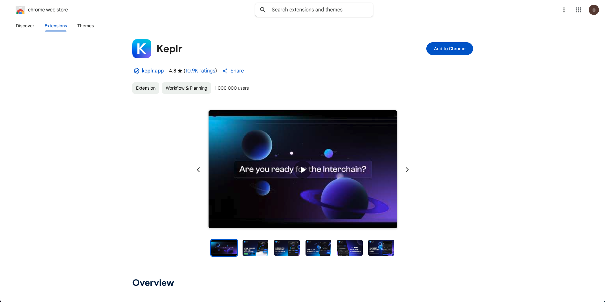
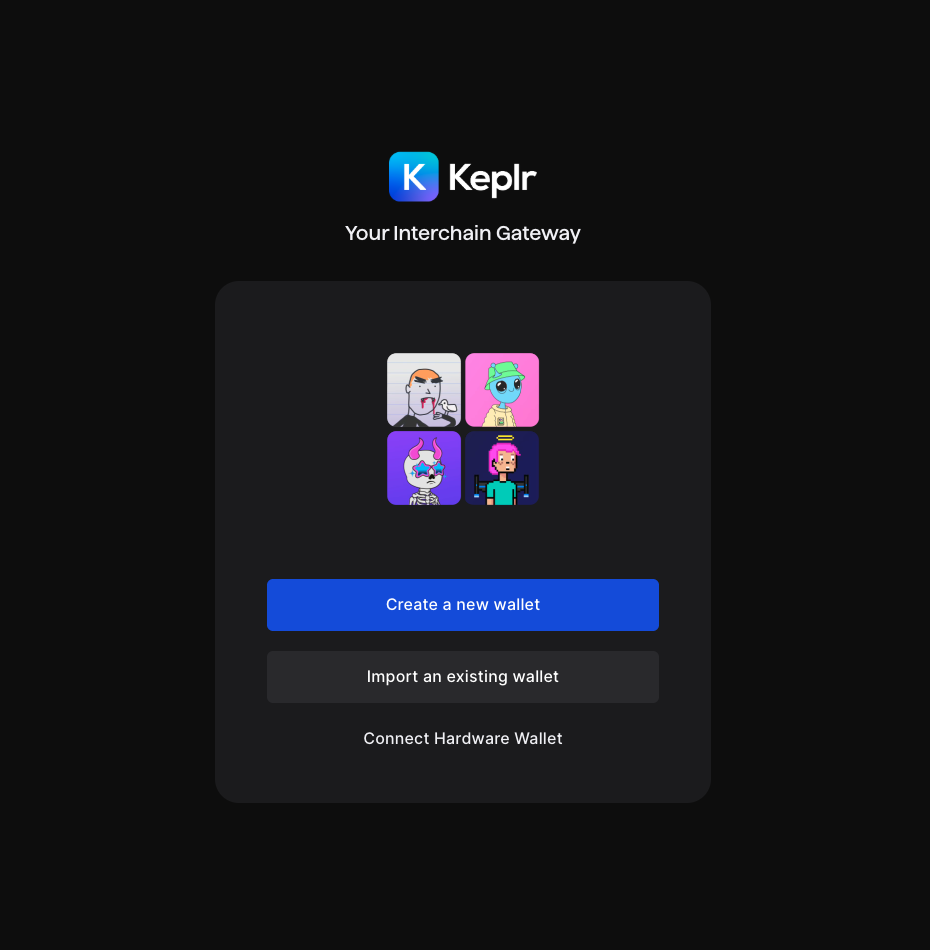
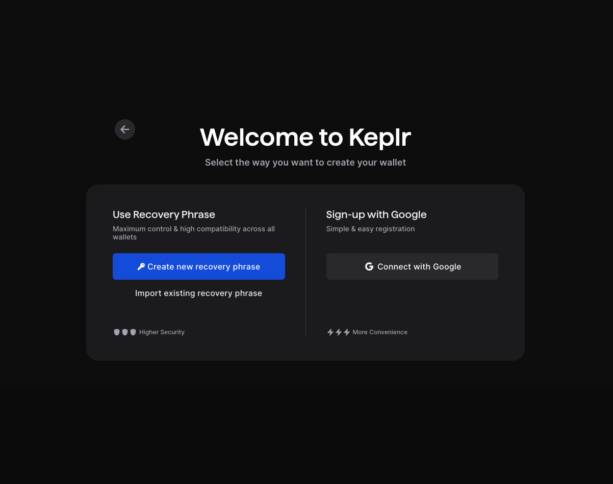
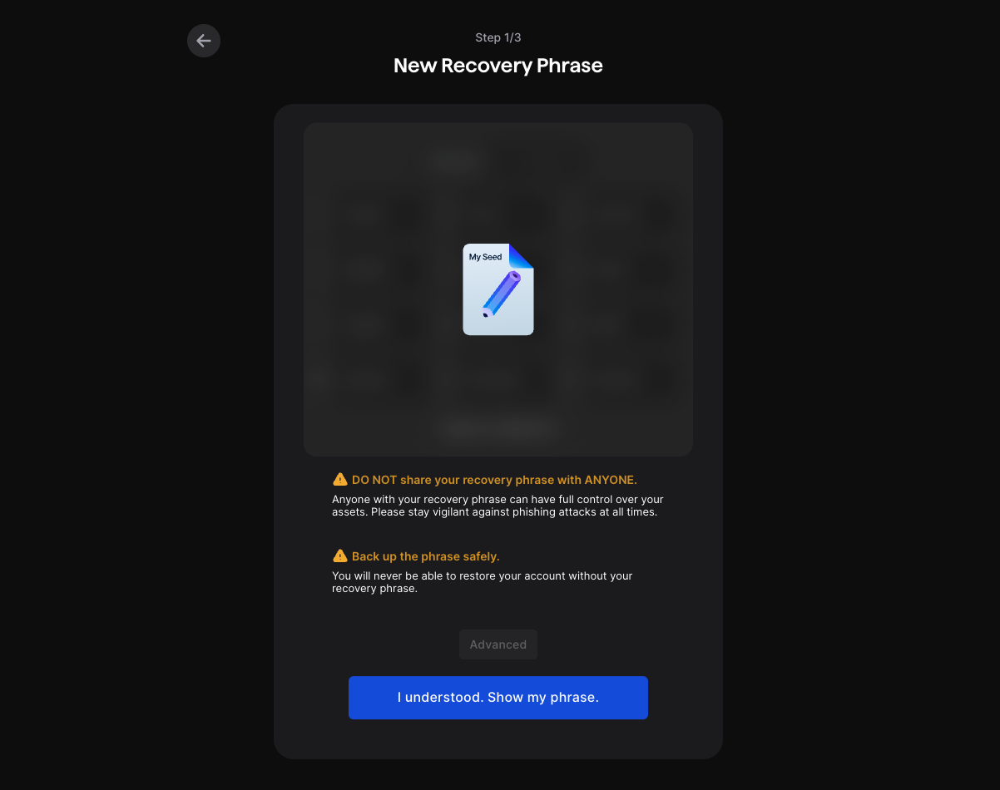
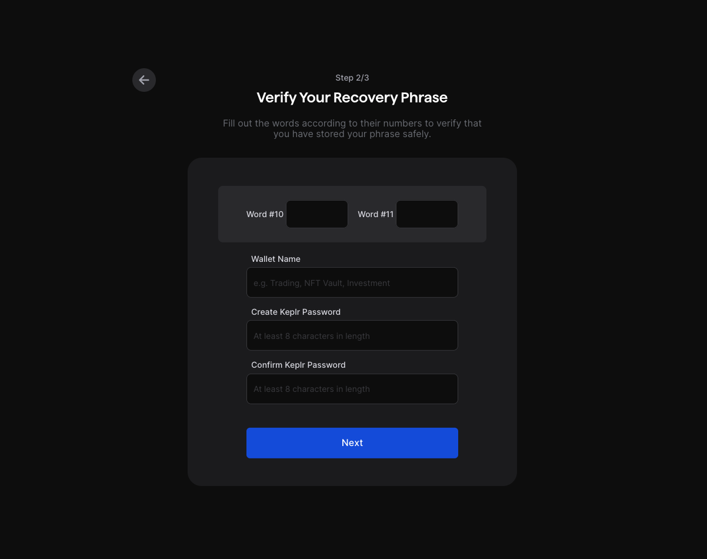
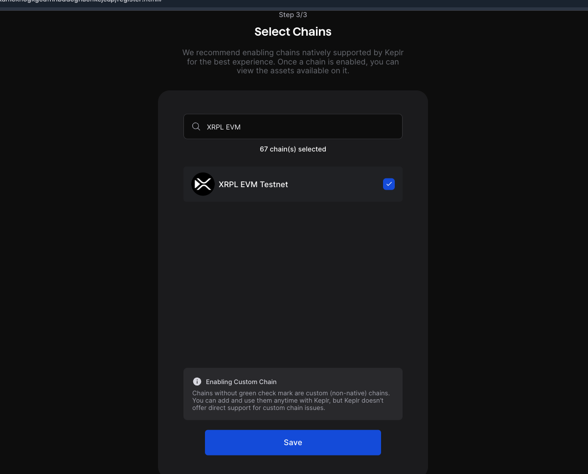
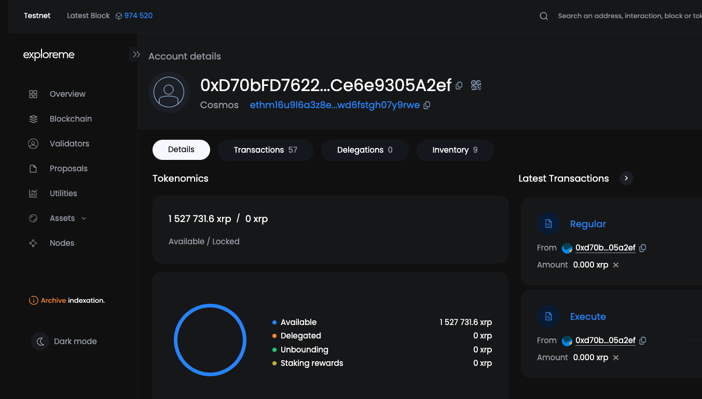
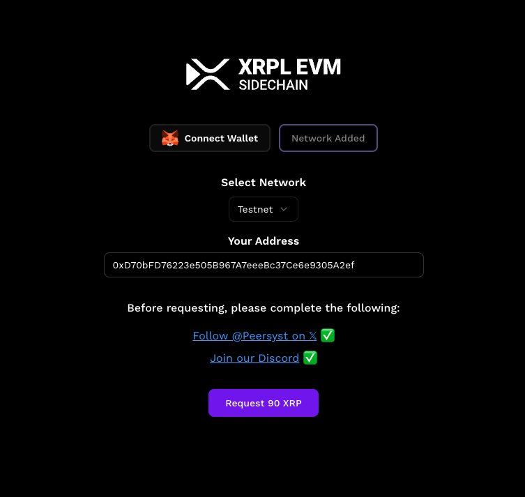
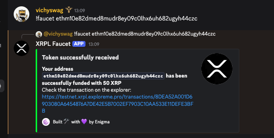

# Install Keplr

This guide explains how to install the Keplr wallet extension for your browser.

---

## Introduction

The XRPL EVM Sidechain is a high-performance, Ethereum-compatible blockchain built using the Cosmos SDK. It integrates seamlessly with the Cosmos ecosystem via the Inter-Blockchain Communication (IBC) protocol, enabling interoperability with over 90 interconnected chains. Keplr, a leading wallet in the Cosmos ecosystem, supports XRPL EVM, allowing users to manage assets and interact with dApps across both Ethereum and Cosmos networks.

---

## Install Keplr

To begin, download and install the Keplr extension for your browser:

1. Visit the [Keplr Chrome Web Store page](https://chromewebstore.google.com/detail/keplr/dmkamcknogkgcdfhhbddcghachkejeap?hl=en).
2. Click **"Add to Chrome"** and confirm the installation.

Once installed, a Keplr icon will appear in your browser's toolbar.

---

## Create a New Keplr Wallet

Follow these steps to create a new Keplr wallet:

1. Click the Keplr icon in your browser.

2. Select **"Create new account."**

3. Choose account back up method.

4. Write down the mnemonic phrase and store it securely.

5. Verify recovery phrase, choose a wallet name and create a secure password.

6. Select chains: Add XRPL EVM Testnet!

Your Keplr wallet is now ready to use with XRPL EVM.

---

## Fund Your XRPL EVM Account with Testnet XRP

To interact with the XRPL EVM Sidechain and perform cross-chain transactions, you'll need testnet XRP in your account.

### Understanding XRPL EVM Address Formats

Each XRPL EVM account has two representations:

- **EVM Address (0x...)**: Used for Ethereum-compatible interactions.
- **Cosmos Address (ethm...)**: Used within the Cosmos ecosystem.

Both addresses correspond to the same account and share the same balance.

To convert between these addresses:

- Use the [Address Translation Tool](../../developers/interacting-with-cosmos/address-translation.md).
- Alternatively, visit the [Exploreme explorer](https://testnet.xrpl.exploreme.pro/account/0xYourEVMAddress) and view your account details to find the corresponding address.

### Obtaining Testnet XRP

#### Option 1: XRPL EVM Faucet

1. Navigate to the [XRPL EVM Faucet](https://faucet.xrplevm.org).
2. Enter your **EVM Address (0x...)**.
3. Click **"Request 90 XRP"**.
4. Wait for the transaction to complete; this typically takes about 2 minutes.

*Note: You may need to complete certain prerequisites, such as joining the Peersyst Discord server, before requesting tokens.*

#### Option 2: Discord Faucet

1. Join the [XRPL EVM Discord Server](https://discord.com/invite/xrplevm).
2. Navigate to the **#faucet** channel.
3. Use the command: `!faucet your_address`
   - Replace `your_address` with either your **EVM Address (0x...)** or **Cosmos Address (ethm...)**.

Example: `!faucet ethm10e82dmed8mudr8ey09c0lhx6uh682ugyh44czc`

*Note: The Discord faucet supports both address formats and is maintained by the Enigma validator.*

---

## What's Next?

With your XRPL EVM account funded, you're now ready to explore cross-chain transactions. The XRPL EVM's integration with the Inter-Blockchain Communication (IBC) protocol enables seamless interoperability with other Cosmos-based networks.

In the next guide, we'll walk you through sending XRP from the XRPL EVM Sidechain to the following testnets:

- **Elys Network Testnet**
- **Cosmos Hub Testnet**
- **Osmosis Testnet**

This process will demonstrate how to leverage IBC for cross-chain transactions, expanding your ability to interact with decentralized applications across the Cosmos ecosystem.

### Continue to the Next Guide:

- **[Sending XRP Through IBC](../sending-through-ibc.md)**: Learn how to transfer XRP from the XRPL EVM Sidechain to other Cosmos-based testnets using Keplr.

--- 

### Additional Resources:

- **Keplr Security Tips**:
  - Always back up your mnemonic phrase in a secure location.
  - Be cautious when interacting with unknown websites or dApps.
  - Regularly check your connected sites in Keplr and revoke access when not in use.