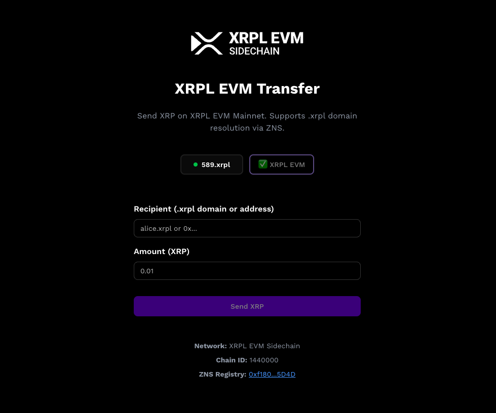
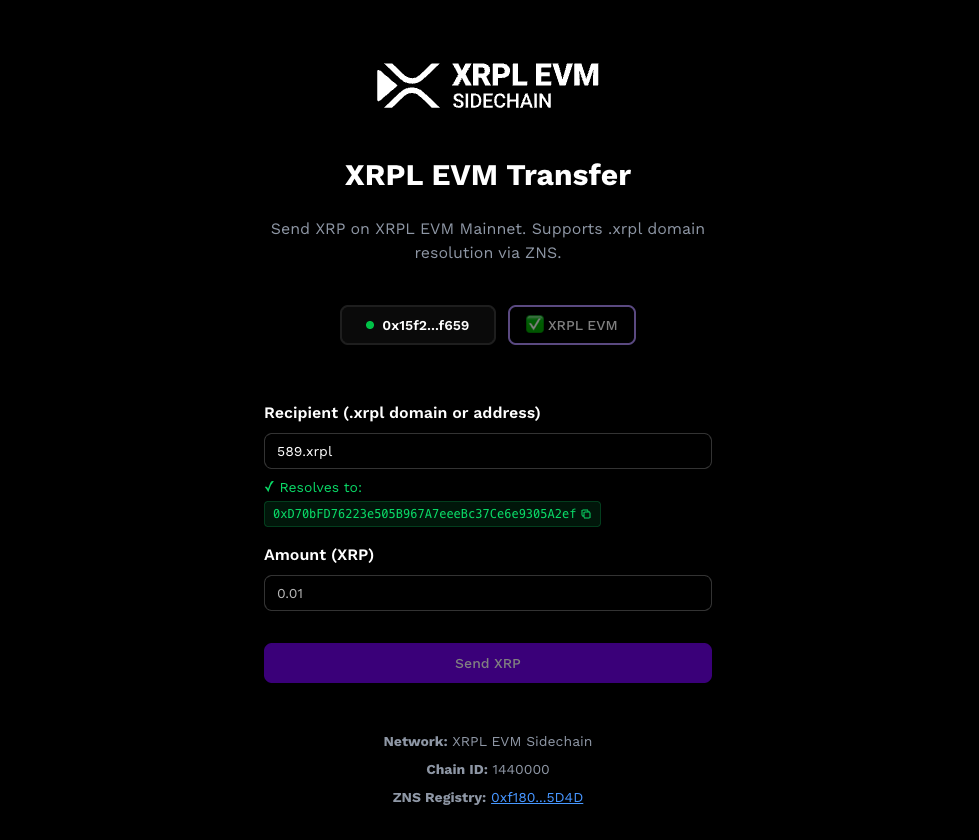

# Transfer to .xrpl Domain

Send XRP to human-readable .xrpl domain names instead of long wallet addresses! The XRPL EVM Transfer tool makes it easy to send XRP using names like **alice.xrpl** instead of complex addresses like `0x1234...abcd`.

## What are .xrpl Domains?

.xrpl domains are human-readable names that resolve to XRPL EVM wallet addresses, similar to how website domains work. Instead of asking someone for their full wallet address, you can simply ask for their .xrpl domain name.

**Benefits:**
- **Easy to remember:** `alice.xrpl` is much easier than `0x742d35Cc6634C0532925a3b844Bc9e7595f0bEb4`
- **Fewer errors:** No more copy-paste mistakes or typos
- **Professional:** Share a clean, branded domain name
- **Verifiable:** Anyone can look up who owns a domain

---

## Using the XRPL EVM Transfer Tool

The easiest way to send XRP to a .xrpl domain is using the official transfer tool at [ens.xrplevm.org](https://ens.xrplevm.org).

### Step 1: Connect Your Wallet

1. **Visit the Transfer Tool**  
   Go to [ens.xrplevm.org](https://ens.xrplevm.org)

2. **Connect MetaMask**  
   - Click **Connect Wallet** in the top right corner
   - Select **MetaMask** from the wallet options
   - Approve the connection request in MetaMask
   - Make sure you're connected to the **XRPL EVM Mainnet** network

   > **Note:** If you haven't added XRPL EVM to MetaMask yet, follow our [Connect to XRPL EVM guide](./connect-to-the-xrpl-evm.md).

### Step 2: Enter the Recipient

1. **Type the .xrpl Domain**  
   In the **Recipient** field, enter the .xrpl domain name (e.g., `alice.xrpl` or `589.xrpl`)

   

2. **Verify the Address**  
   The tool will automatically resolve the domain and show you the wallet address it belongs to. Double-check that it displays the correct address before proceeding.

   > **Tip:** You can also enter a regular `0x...` address if the recipient doesn't have a .xrpl domain yet.

### Step 3: Enter the Amount

1. **Specify XRP Amount**  
   Enter how much XRP you want to send in the **Amount** field

2. **Check Your Balance**  
   Make sure you have enough XRP to cover both the transfer amount and gas fees (usually a fraction of 1 XRP)

### Step 4: Send XRP

1. **Click "Send XRP"**  
   Review all the details one more time:
   - Recipient domain name and resolved address
   - Amount of XRP to send
   - Network (should be XRPL EVM Sidechain)

2. **Confirm in MetaMask**  
   - MetaMask will pop up asking you to confirm the transaction
   - Review the gas fee and total amount
   - Click **Confirm** to send the transaction

3. **Wait for Confirmation**  
   - The transaction usually completes in a few seconds
   - You'll see a success message with a transaction ID
   - Click the transaction ID to view details on the block explorer

---

## Getting Your Own .xrpl Domain

Want to receive transfers using your own .xrpl domain? You can register one on the ZNS platform.

### How to Register

1. **Visit ZNS**  
   Go to [zns.bio](https://zns.bio/search?tab=smart&domain=yourname&chain=1440000)

2. **Search for Your Domain**  
   - Enter your desired name (e.g., `alice`)
   - The system will show if `alice.xrpl` is available

3. **Purchase the Domain**  
   - Connect your wallet
   - Pay the registration fee in XRP
   - Set your domain as your **primary domain** for reverse lookups

4. **Start Receiving Transfers**  
   - Share your .xrpl domain with friends and services
   - Receive XRP using your easy-to-remember name

---

## Frequently Asked Questions

### Can I send to someone without a .xrpl domain?

Yes! The transfer tool accepts both .xrpl domains and regular `0x...` addresses. Simply paste the wallet address in the recipient field.

### What if I enter an invalid domain?

If you enter a domain that doesn't exist or hasn't been registered, the tool will show an error message. Double-check the spelling and try again.

### Can domains expire?

Yes, .xrpl domains have expiration dates and need to be renewed. If a domain has expired, transfers may not work until the owner renews it.

### Is this available on Testnet?

No! This tool is only available for Mainnet.

---

## Need Help?

If you encounter any issues or have questions:

- **Discord Community:** [https://discord.gg/xrplevm](https://discord.gg/xrplevm)
- **Transfer Tool:** [ens.xrplevm.org](https://ens.xrplevm.org)
- **Register Domains:** [zns.bio](https://zns.bio/search?tab=smart&domain=yourname&chain=1440000)

Happy transferring! 🚀
