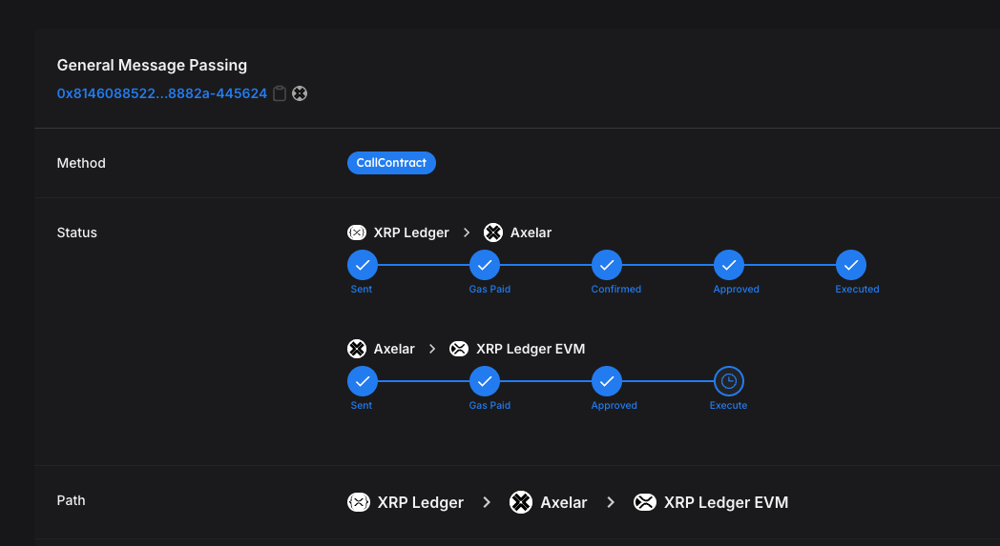
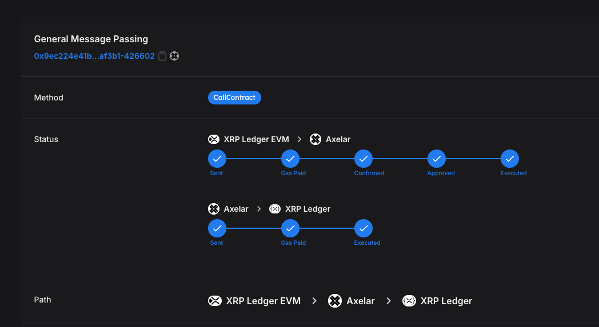

# What is the XRPL EVM bridge

The **XRPL EVM Bridge** serves as a critical component enabling interoperability between the XRP Ledger (XRPL) and the XRPL Ethereum Virtual Machine (EVM) Sidechain. It allows users to transfer assets, initiate smart contract interactions, and leverage decentralized applications across these two ecosystems.

## Key Features of the XRPL EVM Bridge

### Interoperability Across Chains

The XRPL EVM Bridge facilitates seamless communication between the XRPL's high-speed and low-cost native blockchain and the programmability of the XRPL EVM Sidechain. This unlocks:

- **Asset Transfers:** Move XRP and other assets across the XRPL and XRPL EVM seamlessly.
- **Smart Contract Interactions:** Interact with EVM-compatible dApps using XRPL assets.
- **Cross-Chain Liquidity:** Enable liquidity flows between chains for DeFi and other decentralized applications.

### Axelar Integration

Axelar, a decentralized cross-chain communication protocol, powers the XRPL EVM Bridge to provide enhanced security, scalability, and functionality. This ensures:

- **Proof-of-Stake Security:** Transactions are validated by Axelar’s decentralized network of validators, ensuring message integrity and preventing double-spending.
- **Cross-Chain Message Passing:** Axelar General Message Passing (GMP) allows complex data and commands to move between chains, beyond just token transfers.
- **Interchain dApps:** Build decentralized applications that span multiple blockchain ecosystems, leveraging Axelar’s bridging infrastructure.

---

## How the Axelar-Powered Bridge Works

### 1. Asset Transfer from XRPL to XRPL EVM

- **Asset Transfer Initiation:** A user initiates a transaction on the XRPL, specifying the amount of assets to be transferred, the destination chain (XRPL EVM Sidechain), and the recipient address.
  
- **Verification and Relaying:** The transaction is sent to the Axelar Multisig account. Axelar’s validators verify the transaction to prevent double-spending or malicious activities. Upon successful verification, the transaction details are relayed to the Axelar Gateway on the XRPL EVM Sidechain.

- **Execution on Destination Chain:** The Axelar Gateway smart contract processes the transaction on the XRPL EVM Sidechain, executing the transfer of the specified assets to the designated recipient address.

- **Completion Notification:** A completion event is emitted, ensuring transparency and traceability of the transaction, confirming the assets have been successfully transferred.

See the following [example transaction](https://testnet.axelarscan.io/gmp/0x81460885229ec6190dd75138f8573a7c380389f0ddf3ee4f706959313378882a-445624):

### 2. Asset Transfer from XRPL EVM to XRPL

- **Asset Transfer Initiation:** A user initiates a transaction on the XRPL EVM Sidechain, detailing the assets to be transferred, the target chain (XRPL), and the recipient's address.

- **Verification and Relaying:** The transaction is directed to the Axelar Multisig account. Axelar’s validators process and verify the transaction details to ensure security, preventing any potential double-spending or fraudulent activities. After validation, the transaction data is relayed back to the original XRPL network.

- **Execution on Destination Chain:** The Axelar Gateway on the XRPL receives the transaction details and executes the corresponding smart contract to transfer the specified assets to the target address on the XRPL.

- **Completion Notification:** A completion event is generated to confirm the successful transfer, providing transparency and the ability to track the transaction.

See the following [example transaction](https://testnet.axelarscan.io/gmp/0x9ec224e41b407bf612984f266caca4274cec5549c8f2bac7b163adeff37af3b1-426602):

**General Message Passing:**
In addition to asset transfers, the Axelar net facilitates General Message Passing (GMP). This feature allows for arbitrary data transmission and function execution across different blockchain networks. With GMP, developers can trigger complex workflows involving multiple chains, enhancing the capabilities of decentralized applications (dApps) on the XRPL.

---

## Benefits of the Axelar Bridge

### Interchain dApp Development

Axelar’s General Message Passing (GMP) enables the creation of interchain dApps, expanding functionalities across blockchains. Examples include:

- **Cross-Chain DeFi:** A lending protocol on XRPL EVM Sidechain can accept collateral from other blockchains.
- **NFT Marketplaces:** Build marketplaces that span XRPL, XRPL EVM, and Ethereum.

### Scalability and Flexibility

Axelar’s infrastructure supports scalable operations, enabling:

- Token transfers between XRPL and XRPL EVM.
- Smart contract calls across chains with transactional consistency.
