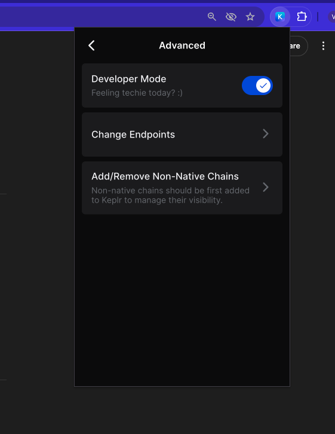
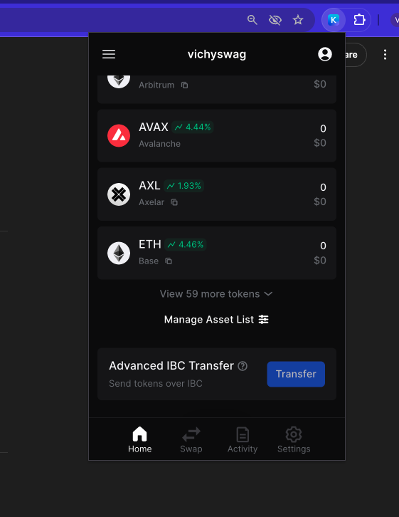
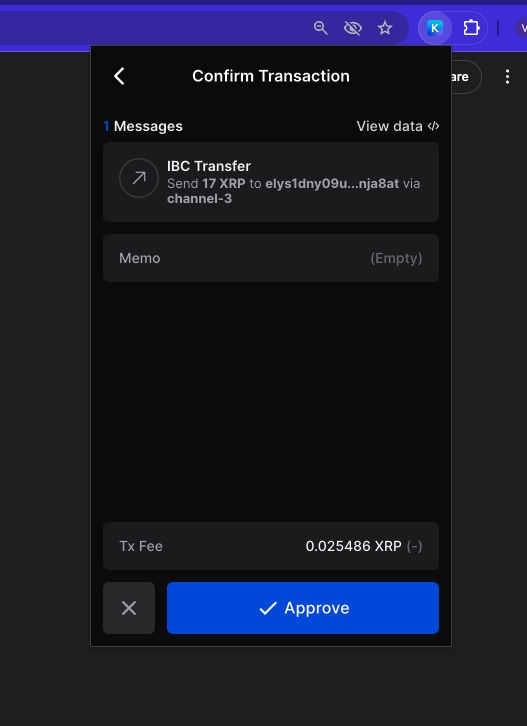

# Sending XRP Through IBC

This guide will show you how to send **XRP** and other tokens from the **XRPL EVM** to other Cosmos chains using IBC via the **Keplr Wallet**.

---

## Prerequisites

Before proceeding, ensure you’ve completed the following:

1. ✅ Installed the **Keplr extension**  
2. ✅ Created a **Keplr wallet account**  
3. ✅ Added the **XRPL EVM** to Keplr  
4. ✅ Funded your account with **XRP**

> 📝 All of these steps are covered in the [Install Keplr Guide](./getting-started/install-keplr.md)

---

## Introduction

The Peersyst team has established IBC channels that connect the XRPL EVM with other Cosmos-based chains, enabling seamless cross-chain token transfers.



      

      ### Supported Channels:

      - **XRPL EVM ↔ Elys Network**
      - **XRPL EVM ↔ Cosmos Hub**
      - **XRPL EVM ↔ Osmosis**
      - **XRPL EVM ↔ Injective**
      - **XRPL EVM ↔ Noble**

      You can use **Keplr's Advanced IBC Transfer** tool to send tokens across these networks.

      ---

      ## Enable Developer Mode in Keplr

      To access the IBC transfer feature:

      1. Open the **Keplr extension** in your browser.
      2. Click the **menu icon (☰)** and go to **Settings**.
      3. Scroll to **Advanced** settings.
      4. Enable **Developer Mode**.

      

      ---

      ## Access the IBC Transfer Menu

      1. Return to the **Keplr main screen** (Home).
      2. Scroll down to the bottom of the chain list.
      3. On **Advanced IBC Transfer** click on **Transfer** to begin the process.

      

      ---

      ## Fill Transfer Details

      1. **Select Asset**:  
         Choose **XRP** or another supported token from XRPL EVM.

      2. **Select Destination Chain**:  
         - If it's not already listed, click **Add New IBC Transfer Channel**.
         - Choose the destination chain and input the **channel ID**.

      ### Channel IDs

      | Destination     | From XRPL EVM (Source → Dest) | To XRPL EVM (Dest → Source) |
      |-----------------|-------------------------------|-----------------------------|
      | Cosmos Hub      | `channel-2`                   | `channel-1377`             |
      | Elys Network    | `channel-1`                   | `channel-27`               |
      | Injective       | `channel-0`                   | `channel-436`              |
      | Osmosis         | `channel-3`                   | `channel-104325`           |
      | Noble           | `channel-4`                   | `channel-152`              |

      3. **Paste Destination Address**:  
         - Ensure it's a valid **Keplr-compatible address** on the target chain.

      4. **Review & Confirm Transfer**:  
         - Check that the **token**, **amount**, **destination address**, and **channel** are correct.
         - Click **Next** to continue.

      5. **Sign the Transaction**:  
         - Keplr will prompt you to sign the transaction.
         - Confirm and approve the transaction to complete the IBC transfer.

      

   

   

   ### Supported Channels:

      - **XRPL EVM Testnet ↔ Elys Network Testnet**
      - **XRPL EVM Testnet ↔ CosmosHub Provider Testnet**
      - **XRPL EVM Testnet ↔ Osmosis Testnet**
      - **XRPL EVM Testnet ↔ Injective Testnet**

      You can use **Keplr's Advanced IBC Transfer** tool to send tokens across these networks.

      ---

      ## Enable Developer Mode in Keplr

      To access the IBC transfer feature:

      1. Open the **Keplr extension** in your browser.
      2. Click the **menu icon (☰)** and go to **Settings**.
      3. Scroll to **Advanced** settings.
      4. Enable **Developer Mode**.

      

      ---

      ## Access the IBC Transfer Menu

      1. Return to the **Keplr main screen** (Home).
      2. Scroll down to the bottom of the chain list.
      3. On **Advanced IBC Transfer** click on **Transfer** to begin the process.

      

      ---

      ## Fill Transfer Details

      1. **Select Asset**:  
         Choose **XRP** or another supported token from XRPL EVM.

      2. **Select Destination Chain**:  
         - If it's not already listed, click **Add New IBC Transfer Channel**.
         - Choose the destination chain and input the **channel ID**.

      ### Channel IDs

      | Destination                | From XRPL EVM (Source → Dest) | To XRPL EVM (Dest → Source) |
      |----------------------------|-------------------------------|-----------------------------|
      | CosmosHub Provider Testnet | `channel-1`                   | `channel-374`               |
      | Osmosis Testnet            | `channel-2`                   | `channel-10361`             |
      | Elys Network Testnet       | `channel-3`                   | `channel-10`                |
      | Injective Testnet          | `channel-4`                   | `channel-77038`             |

      3. **Paste Destination Address**:  
         - Ensure it’s a valid **Keplr-compatible address** on the target chain.

      4. **Review & Confirm Transfer**:  
         - Check that the **token**, **amount**, **destination address**, and **channel** are correct.
         - Click **Next** to continue.

      5. **Sign the Transaction**:  
         - Keplr will prompt you to sign the transaction.
         - Confirm and approve the transaction to complete the IBC transfer.

      

---

   


## Final Tips

- Transfers may take a few minutes to reflect on the destination chain.
- You can track the status using:
  - [XRPL EVM Explorers](../developers/resources/block-explorers.md)
  - The destination chain’s respective testnet explorer

> 🔁 Want to transfer back? Simply reverse the process, using the appropriate **reverse channel ID** in your destination chain’s Keplr wallet.

---