# Transfer IOU with Axelar

## Bridge IOU from XRPL

You can bridge XRPL whitelisted IOU's to XRPL EVM sidechain, and other Axelar supported chains, using Axelar. In this example, we will transfer 10 FOO to an account in the XRPL EVM Sidechain.

1. Set XRPL as the `source chain`, XRPL EVM as `destination chain` and select the `IOU` to transfer.
   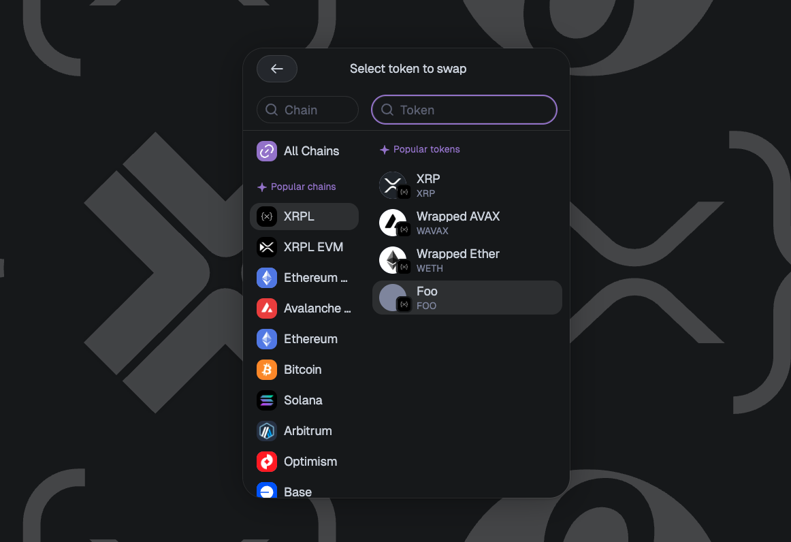

2. `Connect` your XRPL wallet.

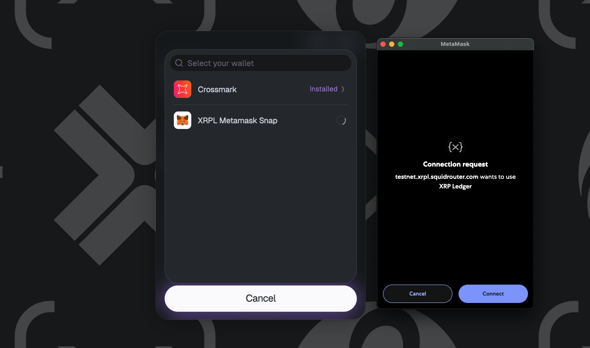

3. `Add recipient`. (Connect EVM wallet or paste address)

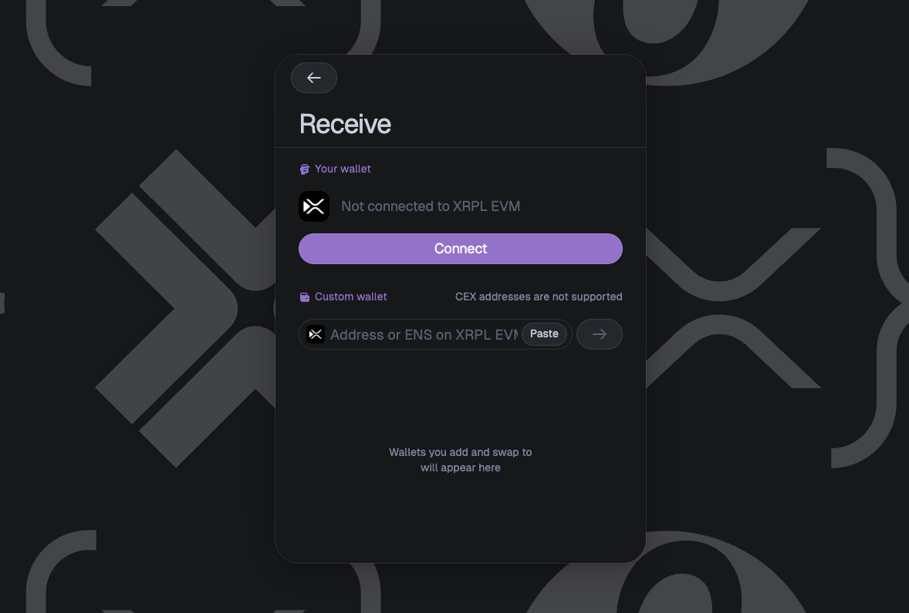

4. Choose the of IOU's `amount` you want to send.

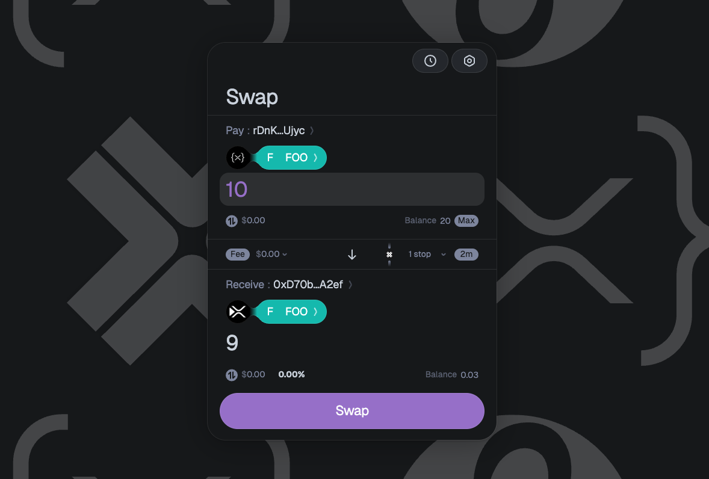

5. Click on `Swap` and confirm the transaction in your XRPL wallet.

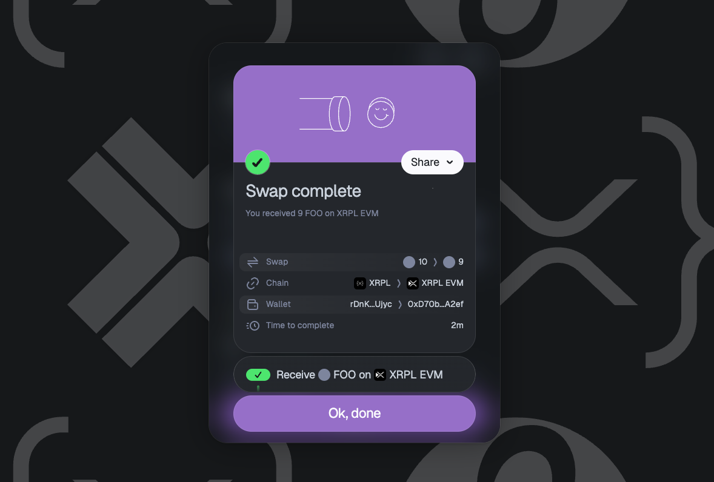

Once the transaction is executed, you can see the transaction details in the following modal, by clicking on "Receive FOO on XRPL EVM"

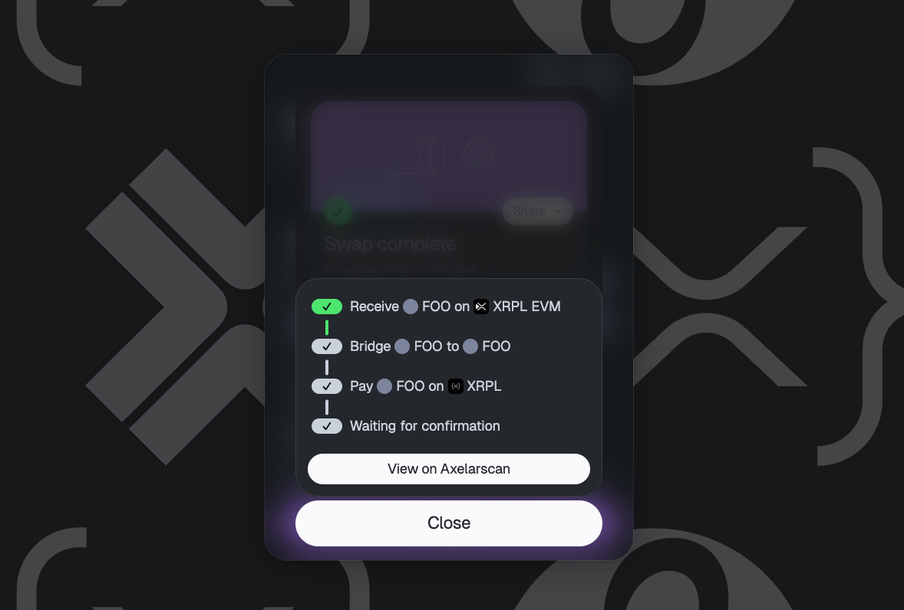

View on [Axelarscan](https://axelarscan.io/) your bridge transction in detail. Find the destination transaction hash on the **Executed** Step at the destination chain section.

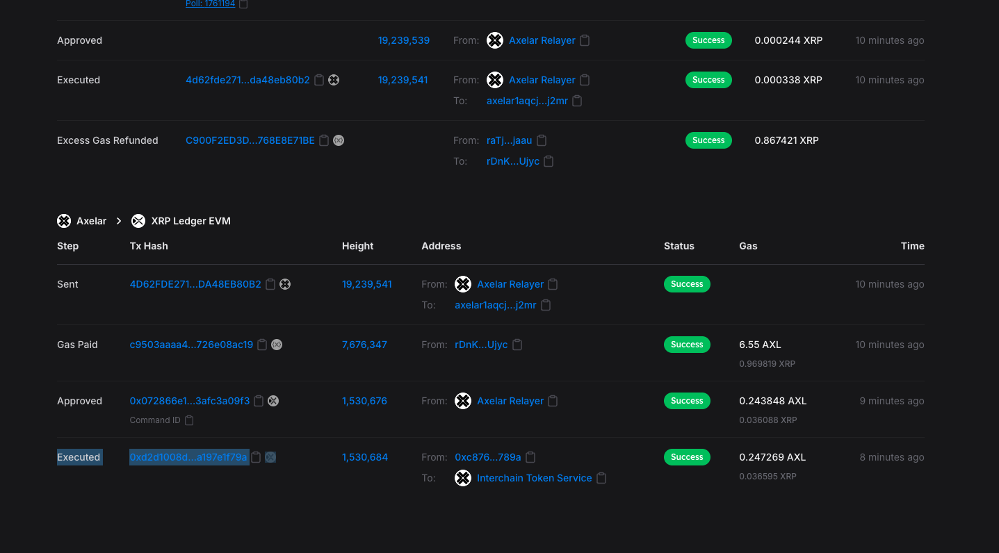

## Bridge IOU from XRPL EVM

You can bridge XRPL whitelisted IOU's from XRPL EVM, and other Axelar supported chains, to XRPL using Axelar. In this example, we will transfer FOO to an account in the XRPL. 


Unlike transfers initiated on XRPL, this direction **does** require you to add the IOU trustline on the XRPL destination (step 5) and approve token spending on EVM (step 6) before executing the swap.


1. Set XRPL EVM as the `source chain`, XRPL as `destination chain` and select the `IOU` to transfer.

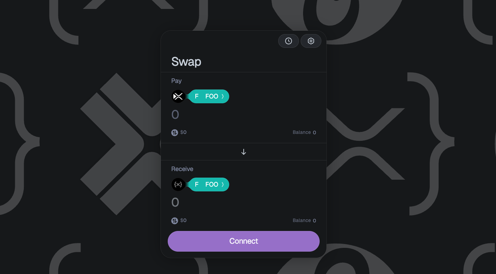

2. `Connect` your XRPL EVM wallet.

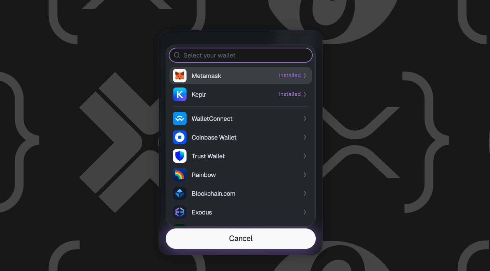

3. `Add recipient`. Connect XRPL wallet or paste rAddress. (Connect if the recipient account has not added the XRPL IOU's trsutline. Needed for Step 5.)

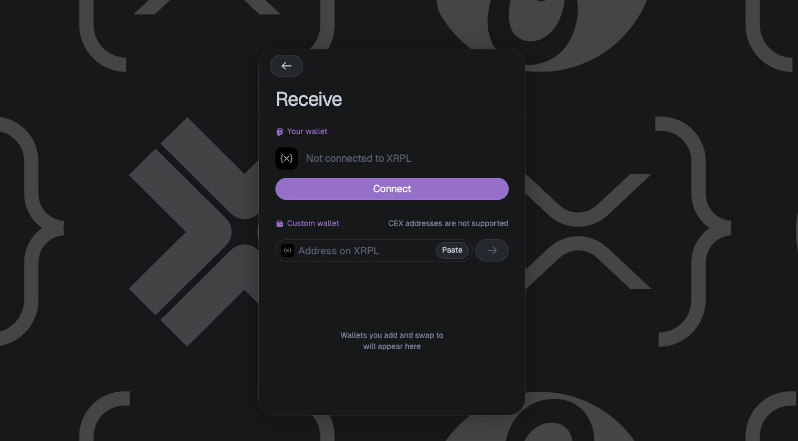

4. Choose the IOU's `amount` you want to send.

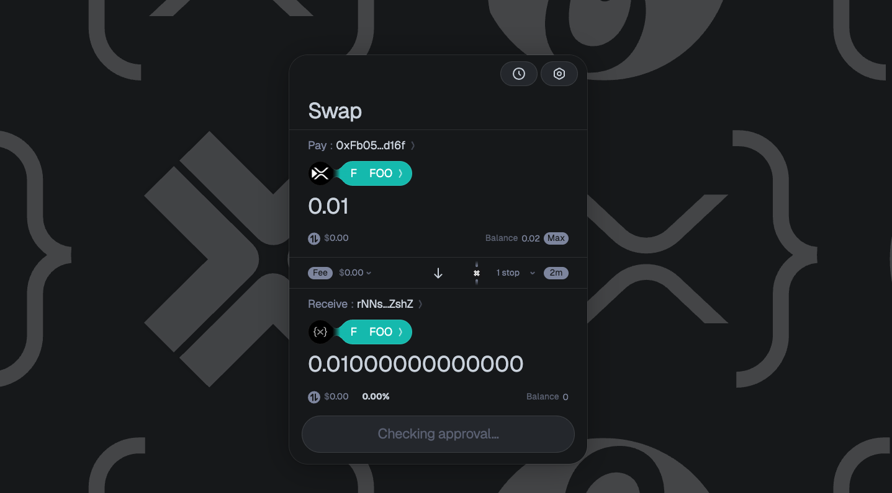

5. `Approve FOO on recipient wallet`. Because FOO is an IOU on the XRPL it requires the destination account to add the IOU's [trustline](https://learn.xrpl.org/glossary/trustline/#:~:text=Main%20Description%3A,what%20happens%20to%20their%20account.) if it is not already. 

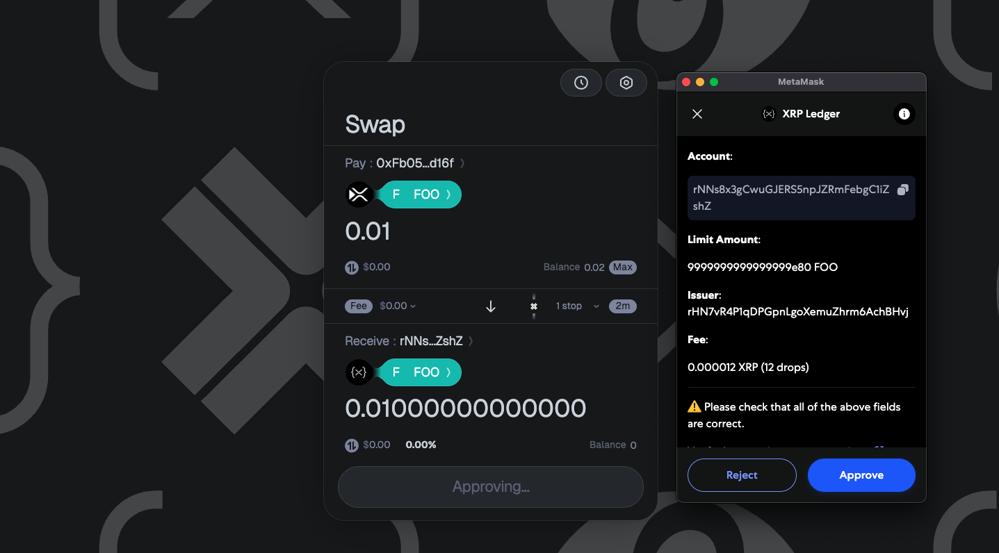

6. `Give permission` to use tokens. Sign the token spending allowance transaction on XRPL EVM.

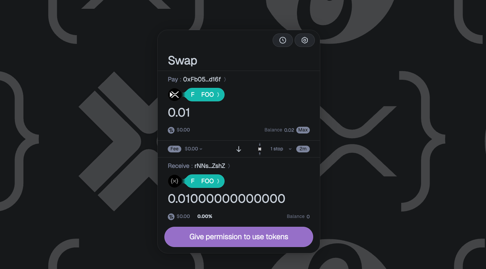

7. Click on `Swap` and confirm the transaction in your XRPL EVM wallet.

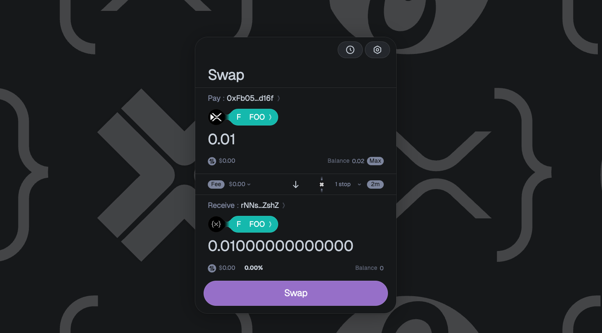

Once the transaction is executed, you can see the transaction details in the following modal, by clicking on "Receive FOO on XRPL"

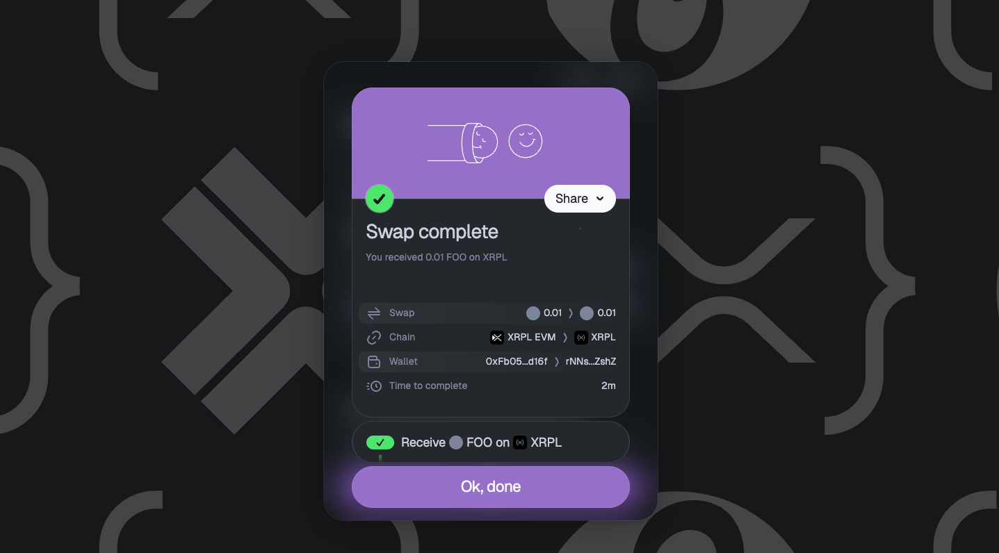

View on [Axelarscan](https://axelarscan.io/) your bridge transction in detail. Find the destination transaction hash on the **Executed** Step at the destination chain section.

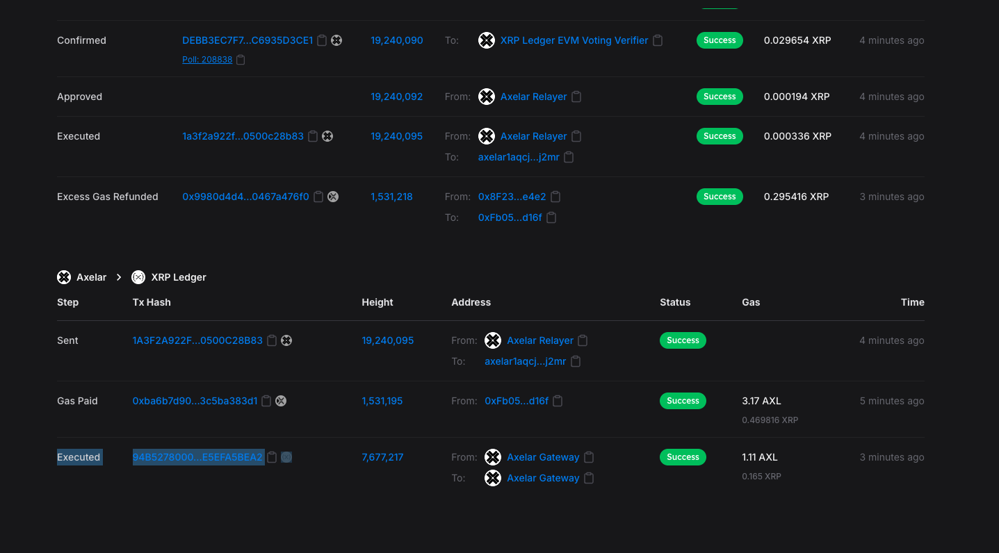
